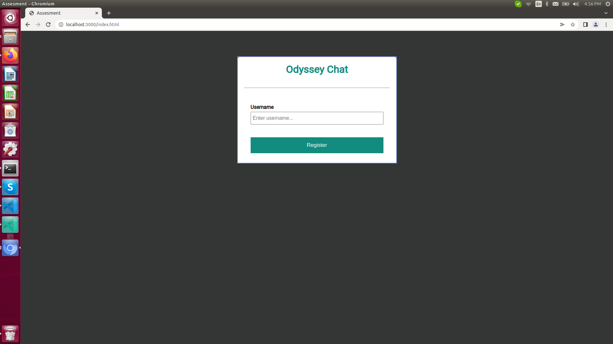
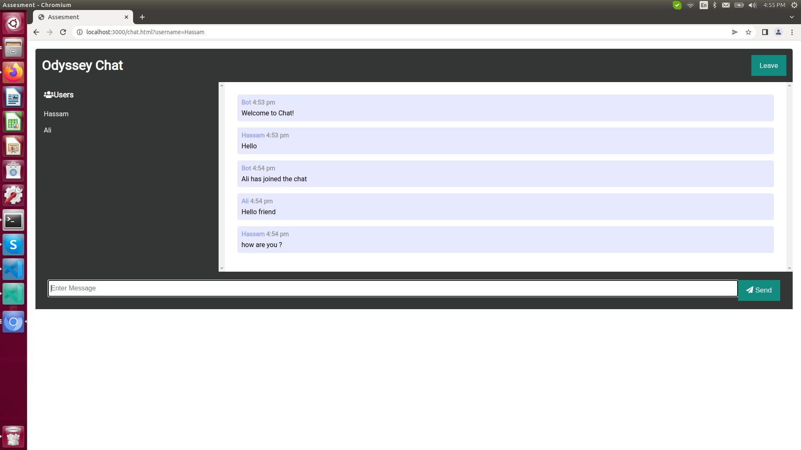

## Setup

***
  ```
  Clone Repo locally
  ```
  ```
  npm install || npm i
  ```
  ```
  npm start
  ```
4. Open your browser and type
  ```
  http://localhost:3000/
  ```
  you can open multiple windows to test app

#
#
#
#
<h1 align="center"> Screenshoots  </h1>
#
#
          



#
#


#
#




